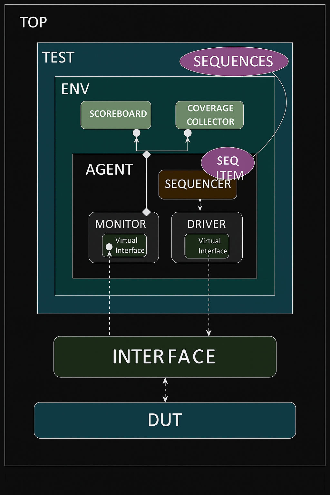

# 📡 SPI Slave UVM Environment



## 📖 Overview
This project implements a **Serial Peripheral Interface (SPI) slave module** in SystemVerilog.  
The design uses a **finite state machine (FSM)** to handle write, read address, and read data operations.  
Assertions are added to validate state transitions and ensure protocol correctness during simulation.

---

## ⚙️ Design Parameters
- **FSM States**:
  - `IDLE` – Wait for chip select (`SS_n`)  
  - `CHK_CMD` – Check command type (write/read)  
  - `WRITE` – Receive data from MOSI  
  - `READ_ADD` – Receive address from MOSI  
  - `READ_DATA` – Transmit data on MISO or receive depending on `tx_valid`  

---

## 🔌 Ports

| Signal      | Direction | Width | Description |
|-------------|-----------|-------|-------------|
| `MOSI`      | Input     | 1     | Master Out Slave In |
| `MISO`      | Output    | 1     | Master In Slave Out |
| `clk`       | Input     | 1     | Clock signal |
| `rst_n`     | Input     | 1     | Active-low reset |
| `SS_n`      | Input     | 1     | Slave select (active low) |
| `tx_valid`  | Input     | 1     | Valid flag for transmit data |
| `tx_data`   | Input     | 8     | Data to be transmitted |
| `rx_data`   | Output    | 10    | Received data buffer |
| `rx_valid`  | Output    | 1     | Indicates valid received data |

---

## 🧩 FSM Flow
1. **IDLE**  
   - Waits for `SS_n` low to begin transaction.  

2. **CHK_CMD**  
   - Decides whether to enter `WRITE`, `READ_ADD`, or `READ_DATA` based on `MOSI` and `received_address`.  

3. **WRITE**  
   - Shifts in data from `MOSI` into `rx_data`.  
   - Asserts `rx_valid` when complete.  

4. **READ_ADD**  
   - Receives address bits from `MOSI`.  
   - Sets `received_address` flag when complete.  

5. **READ_DATA**  
   - If `tx_valid` is high, transmits bits from `tx_data` on `MISO`.  
   - Otherwise, continues to receive data on `MOSI`.  
   - Resets `received_address` after transaction.  

---

## 🛡️ Assertions (Simulation Only)
Assertions are guarded with `ifdef SIM` to run only in simulation.

- **Idle → Check Command**  
  ```systemverilog
  (cs == IDLE) |=> cs == CHK_CMD
  ```
- **Check Command → Next State**  
  Ensures `CHK_CMD` transitions to `WRITE`, `READ_ADD`, or `READ_DATA`.  
- **Write → Idle**  
  Ensures proper return to `IDLE` after write.  
- **Read Address → Idle**  
  Ensures proper return to `IDLE` after address read.  
- **Read Data → Idle**  
  Ensures proper return to `IDLE` after data read.  

Each property has both `assert` and `cover` statements for validation and coverage.

---

## ▶️ Simulation Instructions
1. Compile with QuestaSim or ModelSim:
   ```tcl
   vlog +define+SIM spi_slave.sv
   vsim spi_slave
   run -all
   ```
2. Check assertion results in transcript.  
3. Generate coverage reports to confirm all state transitions are exercised.  

---

## ✨ Notes
- Counter width: 10 bits for data, 8 bits for read data.  
- `received_address` flag ensures proper sequencing between address and data phases.  
- Assertions validate FSM correctness and prevent illegal transitions.  
